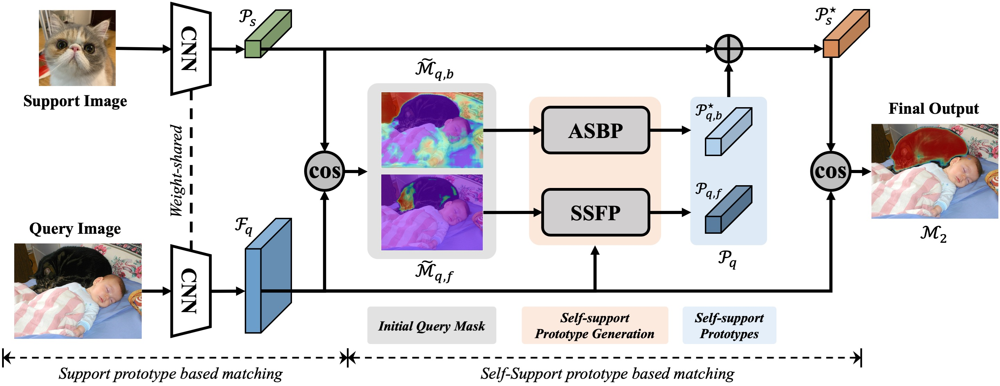

# Self-Support Few-Shot Semantic Segmentation

[Qi Fan](https://github.com/fanq15), [Wenjie Pei](https://wenjiepei.github.io/), [Yu-Wing Tai](https://scholar.google.com/citations?user=nFhLmFkAAAAJ&hl=zh-CN), [Chi-Keung Tang](https://scholar.google.com/citations?user=EWfpM74AAAAJ&hl=zh-CN)


The codebase contains the official code of our paper [Self-Support Few-Shot Semantic Segmentation](https://arxiv.org/abs/2207.11549), ECCV 2022.

中文解读: [ECCV 2022 | SSP: 自支持匹配的小样本任务新思想](https://zhuanlan.zhihu.com/p/545789592)

[](https://paperswithcode.com/sota/few-shot-semantic-segmentation-on-pascal-5i-1?p=self-support-few-shot-semantic-segmentation)\
[](https://paperswithcode.com/sota/few-shot-semantic-segmentation-on-pascal-5i-5?p=self-support-few-shot-semantic-segmentation)\
[](https://paperswithcode.com/sota/few-shot-semantic-segmentation-on-fss-1000-1?p=self-support-few-shot-semantic-segmentation)\
[](https://paperswithcode.com/sota/few-shot-semantic-segmentation-on-fss-1000-5?p=self-support-few-shot-semantic-segmentation)\
[](https://paperswithcode.com/sota/few-shot-semantic-segmentation-on-coco-20i-1?p=self-support-few-shot-semantic-segmentation)\
[](https://paperswithcode.com/sota/few-shot-semantic-segmentation-on-coco-20i-5?p=self-support-few-shot-semantic-segmentation)




## Data preparation

### Download

**Pretrained model:** [ResNet-50](https://drive.google.com/file/d/11yONyypvBEYZEh9NIOJBGMdiLLAgsMgj/view?usp=sharing) | [ResNet-101](https://drive.google.com/file/d/1mX1yYvkcyOkAVjZZSIf6uMBPlooZCmpk/view?usp=sharing)

**Dataset:** [Pascal images and ids](http://host.robots.ox.ac.uk/pascal/VOC/voc2012/VOCtrainval_11-May-2012.tar)
| [Semantic segmentation annotations](https://drive.google.com/file/d/1ikrDlsai5QSf2GiSUR3f8PZUzyTubcuF/view?usp=sharing)


### File Organization

You can follow [HSNet](https://github.com/juhongm999/hsnet) to prepare the MS COCO and FSS-1000 datasets.
```
    ../                         # parent directory
    ├── ./SSP                   # current (project) directory
    |   ├── codes               # various codes
    |   └── ./pretrained        # pretrained model directory
    |            ├── resnet50.pth
    |            └── resnet101.pth
    └── Datasets_SSP/
        ├── VOC2012/            # PASCAL VOC2012 devkit
        │   ├── Annotations/
        │   ├── ImageSets/
        │   ├── ...
        │   └── SegmentationClassAug/
        ├── COCO2014/           
        │   ├── annotations/
        │   │   ├── train2014/  # (dir.) training masks (from Google Drive) 
        │   │   ├── val2014/    # (dir.) validation masks (from Google Drive)
        │   │   └── ..some json files..
        │   ├── train2014/
        │   └── val2014/
        └── FSS-1000/           # (dir.) contains 1000 object classes
            ├── abacus/   
            ├── ...
            └── zucchini/
```


## Run the code

You can adapt the scripts of `all.sh`, `test.sh` and `hsnet_test.sh` (for the HSNet evaluation protocol) to train and evaluate your models.

```
CUDA_VISIBLE_DEVICES=0,1 python -W ignore main.py \
  --dataset pascal --data-root [Your Pascal Path] \
  --backbone resnet50 --fold 0 --shot 1
```

You may change the ``backbone`` from ``resnet50`` to ``resnet101``, change the ``fold`` from ``0`` to ``1/2/3``, or change the ``shot`` from ``1`` to ``5`` for other settings.

You can add/remove `--refine` to enable/disable the self-support refinement.

## Performance and Trained Models

### Pascal VOC

| Method | Setting |   Backbone  | SSP Refine | Fold 0 | Fold 1 | Fold 2 | Fold 3 |  Mean  |
| :-----: | :-----: | :---------: | :----: | :----: | :----: | :----: | :----: | :----: |
| Baseline | 1-shot  |  ResNet-50  | No | [54.9](https://drive.google.com/file/d/1Itnv562-dhfZOV-_upX1BlMFWIGJFFhn/view?usp=sharing)  |  [66.5](https://drive.google.com/file/d/183JO8a3wjIG1ERSie8r0N7QVlV7FgNd_/view?usp=sharing)  |  [61.7](https://drive.google.com/file/d/1X7Z5RfRJNVTndMQgX3nKGbcM-pWIsOPR/view?usp=sharing)  |  [48.3](https://drive.google.com/file/d/1sOj37uXvNQTBeMFC-Dx2A-MaMj7nC-gn/view?usp=sharing)  |  **57.9**  |
| Baseline | 1-shot  |  ResNet-101 | No | [57.2](https://drive.google.com/file/d/10Nco3CvXZgEE_0wDjbyRKoUK3JpkR79q/view?usp=sharing)  |  [68.5](https://drive.google.com/file/d/137JjNvQAksp4PepT93orcHCFCRd6HkFt/view?usp=sharing)  |  [61.3](https://drive.google.com/file/d/1wTUyjqkh4-AuLSExfXPUXvK59C4NTdif/view?usp=sharing)  |  [53.3](https://drive.google.com/file/d/1lWpLX_Wwwb5dINjjGcg3XkxOdZGR_mhM/view?usp=sharing)  |  **60.1**  |
| Baseline | 5-shot  |  ResNet-50  | No | [61.6](https://drive.google.com/file/d/108LOtB9WhbtQYXMWwZviM4CkWY-_RLkN/view?usp=sharing)  |  [70.3](https://drive.google.com/file/d/1yHUFMDGEMmx7sF2Ro-maRidYClneQ2PJ/view?usp=sharing)  |  [70.5](https://drive.google.com/file/d/1NpgYeMDQc2k91dGoUTi3mUPinAd44PlZ/view?usp=sharing)  |  [56.4](https://drive.google.com/file/d/1DdgT7F5ho2P3iGh3uZHR4DCckNSRNFER/view?usp=sharing)  |  **64.7**    |
| Baseline | 5-shot  |  ResNet-101 | No | [64.2](https://drive.google.com/file/d/1_7SqyK1UnDpMZ9CAYhiT7I3n9pT-kZgn/view?usp=sharing)     |  [74.0](https://drive.google.com/file/d/10wmmpqIsn8hv0oRP9--JaE3uuuTvRN8e/view?usp=sharing) |  [71.5](https://drive.google.com/file/d/1S9CY6mcac5cCqS1ucLYaSrTGjOFHn2mW/view?usp=sharing)   |  [61.3](https://drive.google.com/file/d/1oMaDZOaZiPIidbg0s-YTC9wMMNNtXWEF/view?usp=sharing) |   **67.8**   |
| SSP (Ours) | 1-shot  |  ResNet-50  | Yes | [61.4](https://drive.google.com/file/d/1uqBxvGivEiIn6jH2eivVXOLWVUNO1gJD/view?usp=sharing)  |  [67.8](https://drive.google.com/file/d/1bBKdlcz3vWQXGtEY8t4MNo2XM-9HG8Xv/view?usp=sharing)  |  [66.5](https://drive.google.com/file/d/1MyEPrF8Ux5KBOWWqudPuJQH_LGyVlCqo/view?usp=sharing)  |  [50.9](https://drive.google.com/file/d/1S8qMVNL9liFZytv_yxA1TckT7ezBRmAR/view?usp=sharing)  |  **61.7**  |
| SSP (Ours) | 1-shot  |  ResNet-101 | Yes | [63.2](https://drive.google.com/file/d/1kialcbbgsgfaAI-N4fVC-3VnHeW52QWc/view?usp=sharing)  |  [70.4](https://drive.google.com/file/d/1N_pklzBjHOU--S8RhV3lrRHTG3pOxfac/view?usp=sharing)  |  [68.5](https://drive.google.com/file/d/1zUSXihIX2K8vqpTbQbu1XgXCqTLgb8w5/view?usp=sharing)  |  [56.3](https://drive.google.com/file/d/1UwnBAlvYJgJdv-6rJ6d2AJvniDZ5yPYJ/view?usp=sharing)  |  **64.6**  |
| SSP (Ours) | 5-shot  |  ResNet-50  | Yes | [67.5](https://drive.google.com/file/d/15Japc1D-dGsBImGDzHHjp7NYrBhViV6q/view?usp=sharing)  |  [72.3](https://drive.google.com/file/d/1rK8z8axuHUHWo6cNnV1UA8_QkKizBULI/view?usp=sharing)  |  [75.2](https://drive.google.com/file/d/1aypQodpqcl7Jai73XZuqFBep1oUHDUpw/view?usp=sharing)  |  [62.1](https://drive.google.com/file/d/1ioz-vSYBaF1VjypH3bEiO4ya2lwT1uYY/view?usp=sharing)  |  **69.3**    |
| SSP (Ours) | 5-shot  |  ResNet-101 | Yes | [70.9](https://drive.google.com/file/d/1Wh2vCWbP0QqjzIHh-SgI8XwiHSYfUujG/view?usp=sharing)  |  [77.1](https://drive.google.com/file/d/1GoKCMHMKogBbM5RQP71UdpsTT4pmSyta/view?usp=sharing)  |  [78.9](https://drive.google.com/file/d/1kw52KBEMx8eIgVsYwH-ZpNheXQTvMsYE/view?usp=sharing)  |  [66.1](https://drive.google.com/file/d/1Ja1WgLbhHoCveIfopwsUaD3ZWZeHEIGl/view?usp=sharing)  |  **73.3**   |


### MS COCO

| Method | Setting |   Backbone  | Eval Protocol | Fold 0 | Fold 1 | Fold 2 | Fold 3 |  Mean  |
| :-----: | :-----: | :---------: | :----: | :----: | :----: | :----: | :----: | :----: |
| SSP (Ours) | 1-shot  |  ResNet-50  | Ours | [46.4](https://drive.google.com/file/d/17QziEObdCib_2lg7SoEptkt_qoWBpCmy/view?usp=sharing)  |  [35.2](https://drive.google.com/file/d/1HXEvAfpeAc3TJjgy3LRb35EWn2zVgxNT/view?usp=sharing)  |  [27.3](https://drive.google.com/file/d/1qSApqbSyH4ckfFWtg_SAMRXDlsijwkpt/view?usp=sharing)  |  [25.4](https://drive.google.com/file/d/1PjtK1dYFXR5xkyjkmbc2XdobRTJw0cEh/view?usp=sharing)  |  **33.6**  |
| SSP (Ours) | 1-shot  |  ResNet-101  | Ours | [50.4](https://drive.google.com/file/d/1kHZoe3TMextLJZqvnZdNQjQg-pe7Ag0_/view?usp=sharing)  |  [39.9](https://drive.google.com/file/d/1XapUFZE86J0u-jwricmYsumv2cd7pDO8/view?usp=sharing)  |  [30.6](https://drive.google.com/file/d/1A1-1HbZnnRzQjc50-VDNdsByaZ624_5C/view?usp=sharing)  |  [30.0](https://drive.google.com/file/d/1e5W6xbZTisUp8qWRsokaO5Hp_OVGK3B4/view?usp=sharing)  |  **37.7**    |
| SSP (Ours) | 5-shot  |  ResNet-50 | Ours | [53.9](https://drive.google.com/file/d/1MyKP8sIrDwbHBQBXhDxWVg4uDzbfcG0o/view?usp=sharing)  |  [42.0](https://drive.google.com/file/d/1rVEwt2gUrE-pezgOtyi65N4o3_Ku1jAB/view?usp=sharing)  |  [36.0](https://drive.google.com/file/d/1tE5JU-Gnx-z9xgU-8jz5yjefQNMEfpzP/view?usp=sharing)  |  [33.7](https://drive.google.com/file/d/1sJn242NPYlnm-ErJX_fQvT1HWJ8a72jN/view?usp=sharing)  |  **41.4**  |
| SSP (Ours) | 5-shot  |  ResNet-101 | Ours | [57.8](https://drive.google.com/file/d/17_cD0Y4vU3h6OniKGEQr0rbEq1klSqa-/view?usp=sharing)  |  [47.0](https://drive.google.com/file/d/1TMZzGN1flPQqxRc1H62dWpTCjgId2aPb/view?usp=sharing)  |  [40.2](https://drive.google.com/file/d/1B4yagrQ0ugX6EUK2yPoJPRUPl_ENqia_/view?usp=sharing)  |  [39.9](https://drive.google.com/file/d/10eO87EkGVUul9BY5Q2zq4vo_2ZR5SNf5/view?usp=sharing)  |  **46.2**   |
| SSP (Ours) | 1-shot  |  ResNet-50  | HSNet | [35.5](https://drive.google.com/file/d/17QziEObdCib_2lg7SoEptkt_qoWBpCmy/view?usp=sharing)  |  [39.6](https://drive.google.com/file/d/1HXEvAfpeAc3TJjgy3LRb35EWn2zVgxNT/view?usp=sharing)  |  [37.9](https://drive.google.com/file/d/1qSApqbSyH4ckfFWtg_SAMRXDlsijwkpt/view?usp=sharing)  |  [36.7](https://drive.google.com/file/d/1PjtK1dYFXR5xkyjkmbc2XdobRTJw0cEh/view?usp=sharing)  |  **37.4**  |
| SSP (Ours) | 1-shot  |  ResNet-101  | HSNet | [39.1](https://drive.google.com/file/d/1kHZoe3TMextLJZqvnZdNQjQg-pe7Ag0_/view?usp=sharing)  |  [45.1](https://drive.google.com/file/d/1XapUFZE86J0u-jwricmYsumv2cd7pDO8/view?usp=sharing)  |  [42.7](https://drive.google.com/file/d/1A1-1HbZnnRzQjc50-VDNdsByaZ624_5C/view?usp=sharing)  |  [41.2](https://drive.google.com/file/d/1e5W6xbZTisUp8qWRsokaO5Hp_OVGK3B4/view?usp=sharing)  |  **42.0**    |
| SSP (Ours) | 5-shot  |  ResNet-50 | HSNet | [40.6](https://drive.google.com/file/d/1MyKP8sIrDwbHBQBXhDxWVg4uDzbfcG0o/view?usp=sharing)  |  [47.0](https://drive.google.com/file/d/1rVEwt2gUrE-pezgOtyi65N4o3_Ku1jAB/view?usp=sharing)  |  [45.1](https://drive.google.com/file/d/1tE5JU-Gnx-z9xgU-8jz5yjefQNMEfpzP/view?usp=sharing)  |  [43.9](https://drive.google.com/file/d/1sJn242NPYlnm-ErJX_fQvT1HWJ8a72jN/view?usp=sharing)  |  **44.1**  |
| SSP (Ours) | 5-shot  |  ResNet-101 | HSNet | [47.4](https://drive.google.com/file/d/17_cD0Y4vU3h6OniKGEQr0rbEq1klSqa-/view?usp=sharing)  |  [54.5](https://drive.google.com/file/d/1TMZzGN1flPQqxRc1H62dWpTCjgId2aPb/view?usp=sharing)  |  [50.4](https://drive.google.com/file/d/1B4yagrQ0ugX6EUK2yPoJPRUPl_ENqia_/view?usp=sharing)  |  [49.6](https://drive.google.com/file/d/10eO87EkGVUul9BY5Q2zq4vo_2ZR5SNf5/view?usp=sharing)  |  **50.2**   |


## Acknowledgement

This codebase is built based on [MLC's baseline code](https://github.com/LiheYoung/MiningFSS) and we borrow [HSNet](https://github.com/juhongm999/hsnet)'s evaluation protocol for the MS COCO dataset.
We thank [MLC](https://arxiv.org/abs/1908.06391) and other FSS works for their great contributions.

## Other related repos
Few-shot image/video object detection: [FewX](https://github.com/fanq15/FewX)

## Other related papers
  ```bibtex
  @inproceedings{fan2021fsvod,
    title={Few-Shot Video Object Detection},
    author={Fan, Qi and Tang, Chi-Keung and Tai, Yu-Wing},
    booktitle={ECCV},
    year={2022}
  }
  @inproceedings{fan2020cpmask,
    title={Commonality-Parsing Network across Shape and Appearance for Partially Supervised Instance Segmentation},
    author={Fan, Qi and Ke, Lei and Pei, Wenjie and Tang, Chi-Keung and Tai, Yu-Wing},
    booktitle={ECCV},
    year={2020}
  }
  @inproceedings{fan2020fsod,
    title={Few-Shot Object Detection with Attention-RPN and Multi-Relation Detector},
    author={Fan, Qi and Zhuo, Wei and Tang, Chi-Keung and Tai, Yu-Wing},
    booktitle={CVPR},
    year={2020}
  }
  ```
  
## Citation

```bibtex
@inproceedings{fan2022ssp,
  title={Self-Support Few-Shot Semantic Segmentation},
  author={Fan, Qi and Pei, Wenjie and Tai, Yu-Wing and Tang, Chi-Keung},
  journal={ECCV},
  year={2022}
}
```
